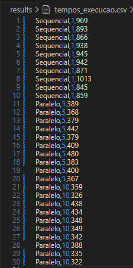

# Desafio 02 - Verificador de Números Primos com Programação Paralela

**Autor(a):** Nathalia Ohana Barigchum Leite

**Disciplina:** Sistemas Distribuídos e Programação Paralela

**Data de Entrega:** 01/09/2025

---

## 1. Objetivo do Projeto

O objetivo deste trabalho é desenvolver e analisar o desempenho de um programa que verifica números primos a partir de um arquivo de entrada (Entrada01.txt).

Foram implementadas **três versões distintas** para fins comparativos:

1.  **Implementação Sequencial:** Utilizando uma única thread.

2.  **Implementação Paralela:** Utilizando 5 threads.

3.  **Implementação Paralela:** Utilizando 10 threads.

O projeto visa demonstrar o ganho de performance (speedup) obtido com a utilização de programação paralela para tarefas computacionalmente intensivas e divisíveis.

## 2. Estrutura do Repositório

O projeto está organizado da seguinte forma:

- **/input**: Contém o arquivo `Entrada01.txt` com a lista de números a serem processados.

- **/output**: Contém os arquivos de saída com a lista de números primos encontrados por cada implementação.

- **/results**: Contém o arquivo `tempos_execucao.csv` com os dados de tempo coletados.

- **/src**: Contém todo o código-fonte Java:

  - `PrimeUtils.java`: Classe utilitária com o método `isPrime()`.

  - `PrimosSequencial.java`: Executável da versão de thread única.

  - `PrimeWorker.java`: Classe `Runnable` que define a tarefa a ser executada pelas threads.

  - `PrimosParalelo5.java`: Executável da versão com 5 threads.

  - `PrimosParalelo10.java`: Executável da versão com 10 threads.

  - `Analise_Desempenho.xlsx`: Planilha com a tabela de tempos e o gráfico comparativo.

  - `README.md`: Este relatório.

## 3. Estratégia de Implementação

### 3.1. Versão Sequencial

A abordagem sequencial é a mais simples e serve como nossa linha de base para comparação de desempenho.

- A thread principal (`main`) é responsável por todo o fluxo.

- Ela lê todos os números do arquivo de entrada `input/Entrada01.txt` para uma lista.

- Em seguida, itera sobre essa lista, número por número, chamando a função `PrimeUtils.isPrime()` para cada um.

- Os números identificados como primos são adicionados a uma nova lista de resultados.

- Ao final, a lista de resultados é gravada no arquivo de saída `output/primos_sequencial.txt`

### 3.2. Versão Paralela

Para as versões paralelas, a estratégia adotada foi a de **Divisão Dinâmica de Carga** para distribuir o trabalho entre as threads.

- **Thread Principal (Orquestradora):**

  1.  Lê todos os números para uma lista compartilhada (`allNumbers`).

  2.  Cria um `Map` sincronizado (`primeResults`) para armazenar os primos encontrados de forma segura (thread-safe). O uso de um `Map<Índice, Número>` é crucial para resolver o desafio de **manter a ordem original** dos resultados.

  3.  Cria um contador atômico (`AtomicInteger`) que servirá para que as threads "peguem" o próximo número a ser processado. **Optei por** `Collections.synchronizedMap` e `AtomicInteger ` **por serem mecanismos de alto nível, eficientes e seguros para operações atômicas específicas (acesso ao mapa de resultados e incremento do contador), evitando a complexidade de blocos** `synchronized` **manuais para estas tarefas.**

  4.  Inicia o número de threads (5 ou 10), onde cada thread recebe uma instância da tarefa `PrimeWorker`.

  5.  Após iniciar todas as threads, a thread principal fica em estado de espera, utilizando o método `thread.join()`, aguardando a finalização de todas as workers.

  6.  Quando todas as workers terminam, a thread principal reconstrói a lista de primos na ordem correta a partir do `Map` e a salva no arquivo de saída `primos_paralelo5.txt` ou `primos_paralelo10.txt`.

- **Threads de Trabalho (`PrimeWorker`):**

  - Cada thread executa um loop contínuo.

  - Dentro do loop, a thread pega o índice do próximo número a ser processado de forma atômica. Isso garante que duas threads nunca processem o mesmo número.

  - A verificação de primalidade (`isPrime()`), que é a parte mais custosa, é executada em paralelo por todas as threads.

  - Se um número é primo, ele é adicionado ao `Map` de resultados sincronizado.

Esta abordagem é eficiente porque threads que terminam de processar um número (seja ele pequeno ou grande) podem imediatamente pegar o próximo disponível, garantindo que nenhuma thread fique ociosa enquanto outras ainda têm trabalho a fazer (balanceamento de carga).

## 4. Como Compilar e Executar

1.  **Compilar todos os arquivos:**

    ```bash
    javac src/*.java -d bin
    ```

2.  **Executar a versão Sequencial:**

    ```bash
    java -cp bin PrimosSequencial
    ```

3.  **Executar a versão Paralela com 5 Threads:**

    ```bash
    java -cp bin PrimosParalelo5
    ```

4.  **Executar a versão Paralela com 10 Threads:**
    ```bash
    java -cp bin PrimosParalelo10
    ```

## 5. Análise de Desempenho

Após executar todas as implementações, os tempos de execução foram coletados no arquivo `results/tempos_execucao.csv` e consolidados abaixo.

_Observação: Foi executado cada versão algumas vezes para obter uma média de tempo mais estável e assim criar um gráfico com mais performance._




**Tabela de Tempos de Execução (Média)**

| Implementação | Nº de Threads | Tempo Médio (ms) | Speedup                 |
| ------------- | ------------- | ---------------- | ----------------------- |
| Sequencial    | 1             | 1004             | -                       |
| Paralelo      | 5             | 394              | Aprox. 2,55 mais rápido |
| Paralelo      | 10            | 396              | Aprox. 2,54 mais rápido |

_O **Speedup** é calculado como: (Tempo Sequencial) / (Tempo Paralelo)._

Então:

- 1004 / 394 = 2,55x

- 1004 / 396 = 2,54x


### 6. Análise dos Resultados

---

A análise dos dados demonstra dois pontos principais:

- **A paralelização resultou em um ganho de performance significativo**. A implementação sequencial levou em média **1004 ms**, enquanto a versão com 5 threads reduziu esse tempo para **394 ms**, um **speedup de 2,55 vezes**. Isso comprova que a estratégia de dividir o trabalho entre múltiplos processadores foi altamente eficaz.

- Observa-se um **platô de desempenho ao aumentar o número de threads de 5 para 10**. A versão com 10 threads teve um tempo médio de **396 ms**, ligeiramente superior à de 5 threads. Isso indica que simplesmente adicionar mais workers não garantiu uma melhoria, introduzindo, na verdade, uma pequena sobrecarga (overhead).

## 7. Correlação com o Hardware de Teste

A explicação para o platô de desempenho encontrado está diretamente ligada às especificações do hardware utilizado para os testes. O processador, um **Intel Core i7 8550U**, possui **4 núcleos físicos e 8 threads lógicas**. Isso significa que:

- A versão com **5 threads** utilizou os recursos de hardware de forma muito eficiente, pois o sistema operacional pôde alocar cada thread para um dos 8 processadores lógicos disponíveis.

- A versão com **10 threads**, por outro lado, criou mais tarefas do que o processador consegue executar simultaneamente. Isso força o sistema a realizar **"trocas de contexto"** constantes para gerenciar as threads excedentes, gerando um custo operacional que anula e até reverte os potenciais ganhos.

Informações do Hardware testado (meu notebook pessoal):


## 8. Conclusão

Com essa análise, podemos comprovar que, embora a paralelização seja uma ferramenta poderosa para otimização, seu ganho é intrinsecamente limitado pela arquitetura do hardware. **Para este cenário, a configuração com 5 threads representou o ponto ótimo de desempenho, utilizando eficientemente os recursos do processador sem incorrer no custo de gerenciamento excessivo de threads**.
